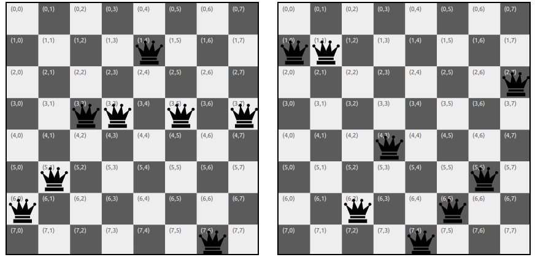
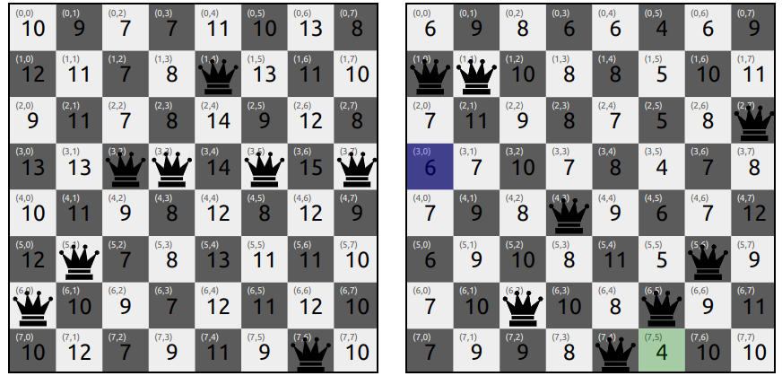
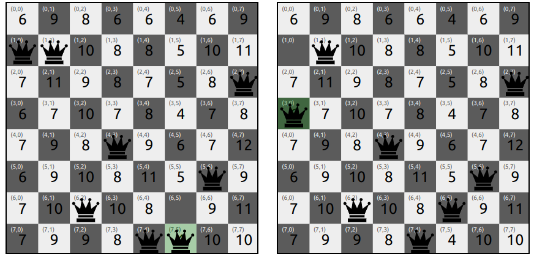
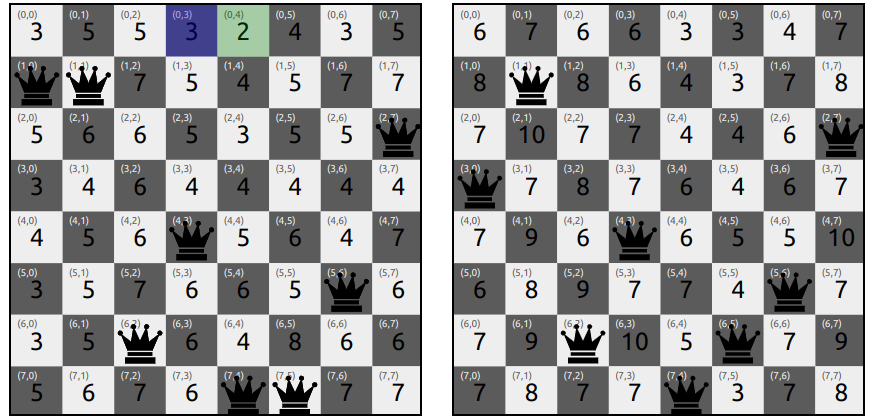
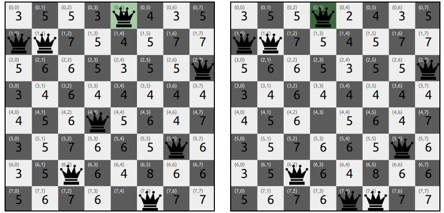
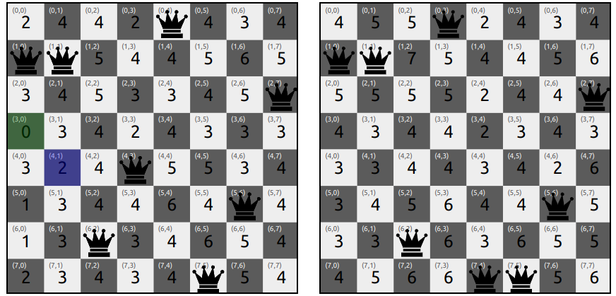
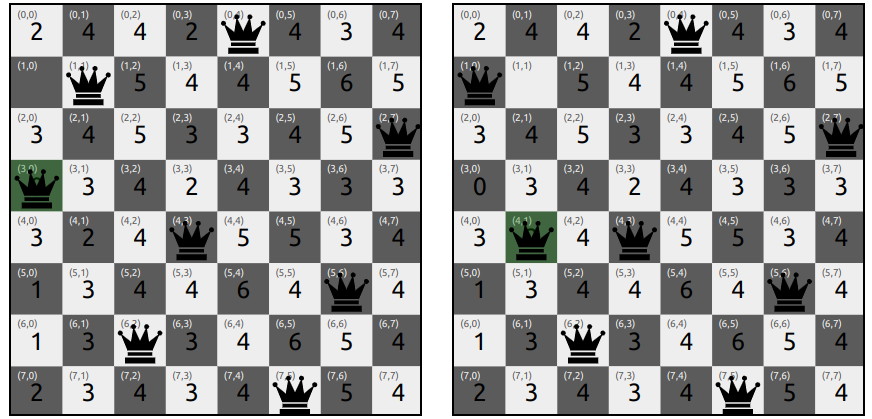
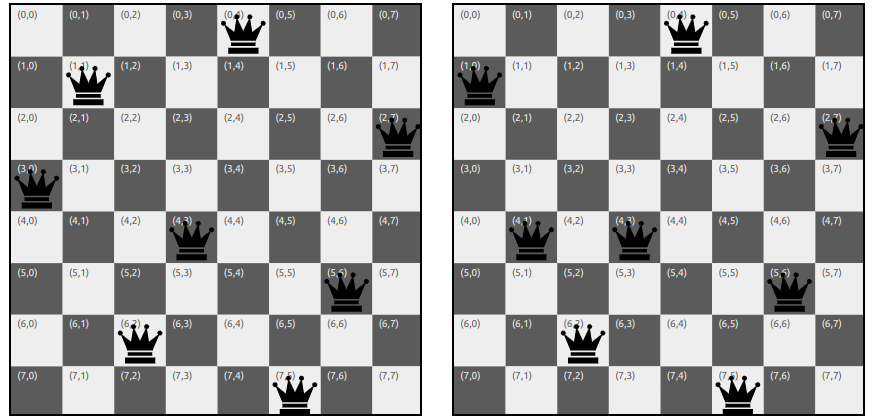

# Beam Search

## Introduction to Local Beam Search
The local beam search algorithm keeps track of **k states** rather than just one like in Hill Climbing. It begins with **k randomly generated states**. At each step, all the successors of all k states are generated. If any one is a goal, the algorithm halts. Otherwise, it selects the k best successors from the complete list and repeats.  
Unlike Hill Climbing, beam search leverages useful information shared among parallel search threads, allowing it to focus on areas of the search space with a higher likelihood of reaching the goal. 
While the core concept is similar to Hill Climbing, local beam search differs in its simultaneous exploration of multiple states and the selection of the top k successors to guide further search.

### N Queens Example

* The goal of the 8-queens problem is to place eight queens on a chessboard such that no queen attacks any other. (A queen attacks any piece in the same row, column or diagonal) 
* There are two types of formulations:
    * An **incremental formulation** that uses operators to progressively expand or enhance the state description, starting with an empty state; for the N queens problem, this means that each action adds a queen to the state. 
    * A **complete-state formulation** starts with all 8 queens on the board and moves them around.
* This experiment uses a **complete-state formulation**, where each state has 8 queens on the board, one per column. The successors of a state are all possible states generated by moving a single queen to another square in the same column (so each state has 8 × 7 = 56 successors). 

### The Heuristic Function
* The heuristic cost function h is the number of pairs of queens that are attacking each other, either directly or indirectly.
* The aim of the algorithm is to minimize the heuristic cost function h, which is 0 when the state is a solution to the problem.

### Algorithm Steps
1. **Initialization:** Start with k random states.
2. **Successor Generation:** Generate all possible successor states by moving a single queen to another square in the same column for all k states.
3. **Selection:** Choose the best k successor states with the lowest heuristic costs.
4. **Termination:** If one of the selected states is the goal state (h = 0), terminate the algorithm; otherwise, repeat steps 2-3.

**Tie Breaking**: Beam Search algorithms typically choose randomly among the set of best successors if there are more than k.

## Example Problem
Consider the 8-queens problem, where the goal is to place 8 queens on an 8x8 chessboard such that no two queens attack each other. The heuristic function h is the number of pairs of queens that are attacking each other. The goal state has h = 0.  
Below is the initial state of the 8-queens problem, where each queen is placed in a different column.  
For this problem, the beam width is chosen as 2. Thus, the initial states consist of 2 randomly generated initial configurations. In this example, the heuristc value of the boards are h = 11 and h = 8 respectively. 
### Initial State:

### Iteration 1:
As we can see from the picture below, the neighbouring states with h = 4 (Best Heuristic Value) and h = 6 (Second Best Heuristic Value) are selected as the next states since the width of the beam is 2.   
The algorithm continues to select the top 2 neighbours in each iteration until it reaches the goal state with h=0. 

### Iteration 2:

### Iteration 3:
The algorithm find the neighbour state with h = 0 on the left board and terminates as it is the goal state.

### Solution:
The algorithm reaches the goal state with h = 0 on the left board, where no queens are attacking each other. The final state on the left board is the solution to the 4-queens problem.

### Disadvantages
Local beam search can suffer from a lack of diversity among the k states—they can quickly become concentrated in a small region of the state space, making the search little more than an expensive version of hill climbing.

### Beam Search Variants
1. **Stochastic Beam Search**: Instead of choosing the best k from the the pool of candidate successors, stochastic beam search chooses k successors at random, with the probability of choosing a given successor being an increasing function of its value.

## Pseudo Code

