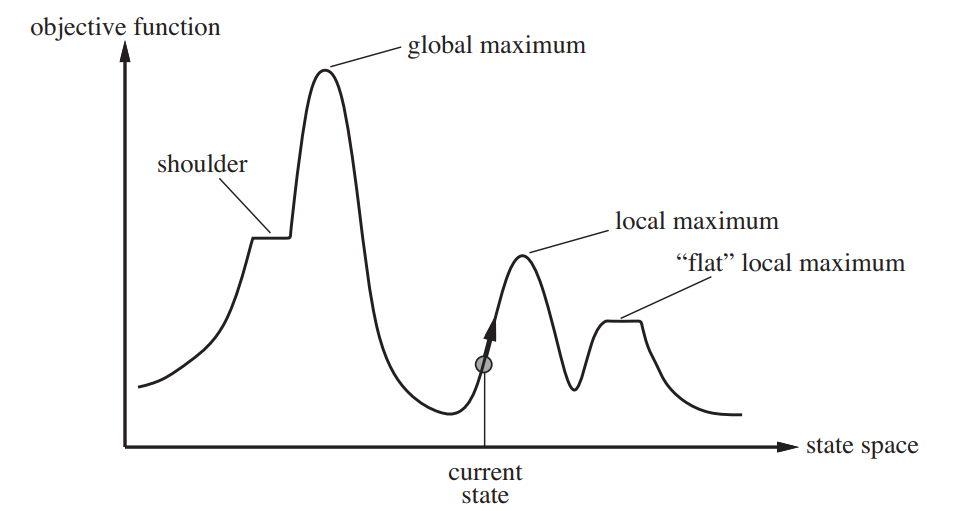
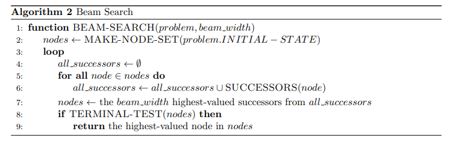

# Hill Climbing

## Introduction to Hill Climbing
Hill climbing algorithm (steepest ascent) is a local search algorithm which continuously moves in the direction of increasing elevation/value to find the peak of the mountain or best solution to the problem. It terminates when it reaches a peak value where no neighbor has a higher value.
It is also called greedy local search as it only looks to its good immediate neighbor state and not beyond that.The algorithm does not maintain a search tree, so the data structure for the current node need only record the state and the value of the objective function.

### N Queens Example

* The goal of the 8-queens problem is to place eight queens on a chessboard such that no queen attacks any other. (A queen attacks any piece in the same row, column or diagonal.) 
* An incremental formulation involves operators that augment the state description, starting with an empty state; for the 8-queens problem, this means that each action adds a queen to the state. A complete-state formulation starts with all 8 queens on the board and moves them around.
* This experiment uses a complete-state formulation, where each state has 8 queens on the board, one per column. The successors of a state are all possible states generated by moving a single queen to another square in the same column (so each state has 8 × 7 = 56 successors). 

### The Heuristic Function
* The heuristic cost function h is the number of pairs of queens that are attacking each other, either directly or indirectly.
* The aim of the algorithm is to minimize the heuristic cost function h, which is 0 when the state is a solution to the problem.

### Algorithm Steps
1. **Initialization:** Start with a random state.
2. **Successor Generation:** Generate all possible successor states by moving a single queen to another square in the same column.
3. **Selection:** Choose the best successor state with the lowest heuristic cost.
4. **Termination:** If the selected state is the goal state (h = 0), terminate the algorithm; otherwise, repeat steps 2-3.

**Tie Breaking**: Hill-climbing algorithms typically choose randomly among the set of best successors if there is more than one.

### Disadvantages
Though Basic Hill Climbing reaches a soluion quickly, it can often get stuck due to the following reasons:
1. **Local Optima**: It may get stuck at a local optima and not reach the global optima. A local maximum is a peak that is higher than each of its neighboring states but lower than the global maximum. Hill-climbing algorithms that reach the
vicinity of a local maximum will be drawn upward toward the peak but will then be stuck with nowhere else to go.
2. **Ridges**: Ridges result in a sequence of local maxima
that is very difficult for greedy algorithms to navigate.
3. **Plateaux**: It can be a flat local maximum, from which no uphill exit exists, or a **shoulder**, from which progress is possible. A hill-climbing search might get lost on the plateau.

**Sideways Move**: Basic Hill Climbing stops if it reaches a plateau where the best successor has the same value as the current state. A **sideways move** does not terminate in this case in the hope that the plateau is really a shoulder and a better state can be reached after more steos. This could however lead to an infinite loop.

## Hill Climbing Variants
Other variants of Hill Climbing have been developed to overcome these limitations, such as:

1. **Stochastic Hill Climbing**: The algorithm chooses at random from among the uphill moves; the probability of selection can vary with the steepness of the uphill move. This usually converges more slowly than steepest ascent, but in some
state landscapes, it finds better solutions.
2. **First-choice Hill Climbing**: First-choice hill climbing implements  stochastic hill climbing by generating successors randomly until one is generated that is better than the current state. This is a good strategy when a state has many (e.g., thousands) of successors.
3. **Random-Restart Hill Climbing**: It conducts a series of hill-climbing searches from randomly generated initial states until a goal is found.If each hill-climbing search has a probability p of success, then the expected number of restarts required is 1/p. 

### Convergence and Optimality

As explained above, Hill Climbing can converge to a local maxima instead of a global maxima. Numerous strategies have been developed to address this.

## Pseudo Code

